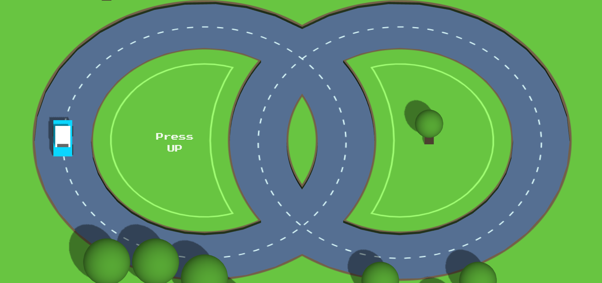

# Traffic Run Game with Three.js

A 3D endless runner game where you control a car navigating through traffic, built using [Three.js](https://threejs.org/). Dodge obstacles, collect points, and see how far you can go!

## Features

- **3D Graphics**: Realistic car and environment rendered with Three.js.
- **Endless Gameplay**: The road and obstacles are procedurally generated for endless fun.
- **Obstacle Avoidance**: Dodge moving vehicles and static obstacles.
- **Score System**: Earn points for distance traveled and items collected.
- **Responsive Controls**: Playable on desktop with keyboard controls.
- **Sound Effects**: Engaging audio feedback for actions and collisions.

## Screenshots



## Getting Started

### Prerequisites

- [Node.js](https://nodejs.org/) (for running a local server, if needed)
- Modern web browser (Chrome, Firefox, Edge, etc.)

### Installation

1. **Clone the repository:**
   ```bash
   git clone https://github.com/Jhinkz018/trafficrun.git
   ```
2. **Navigate to the project folder:**
   ```bash
   cd "Traffic Run Game with Three.js"
   ```
3. **Start a local server (optional, but recommended):**
   ```bash
   npx serve .
   ```
   Or use any static server of your choice.

4. **Open `index.html` in your browser.**

## Controls

- **Arrow Keys / WASD**: Move the car left, right, forward, or backward.
- **Spacebar**: (If implemented) Jump or perform special action.
- **R**: Restart the game after a collision.

## Folder Structure

```
Traffic Run Game with Three.js/
├── assets/           # Images, models, and sounds
├── src/              # JavaScript source files
├── index.html        # Main HTML file
├── style.css         # Stylesheet
├── readme.md         # This file
```

## Technologies Used

- [Three.js](https://threejs.org/) for 3D rendering
- JavaScript (ES6)
- HTML5 & CSS3

## Credits

- Game design and development: [Jhinkz018](https://github.com/Jhinkz018)
- 3D models and textures: [Sources or credits]
- Sound effects: [Sources or credits]
- Inspired by popular endless runner games.

## License

This project is licensed under the MIT License. See [LICENSE](./LICENSE) for details.

---

Enjoy the game! Feel free to contribute or suggest improvements.
